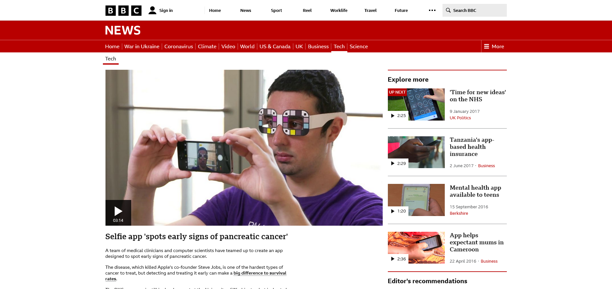
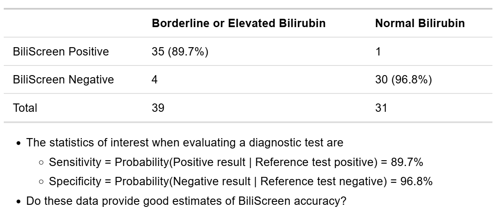
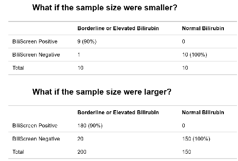
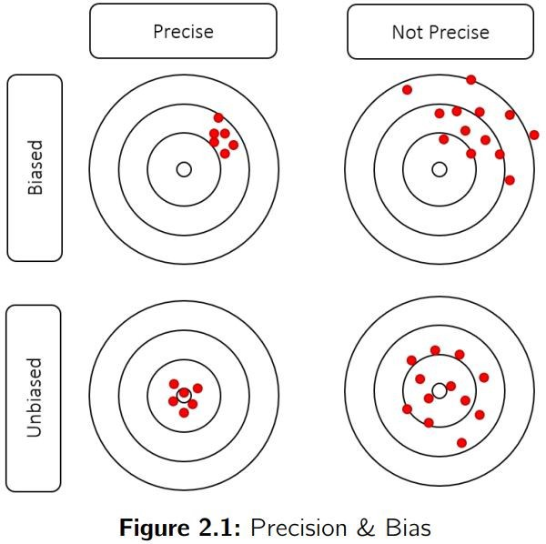

```{r setup, include=FALSE}
knitr::opts_chunk$set(echo = TRUE, fig.width = 3,fig.height = 3, fig.align="center")
```


# What is Statistics

> Statistics is a collection of procedures and principles for gathering data and analyzing
information in order to help people make decisions when faced with uncertainty

> Utts & Heckard in ‘Statistical Ideas & Methods’

# What is Biostatistics

> -  bi·o·sta·tis·tics

>   noun

> the branch of statistics that deals with data relating to living organisms.


> - Biostatistics is the application of statistical techniques to scientific research in health-related fields, including medicine, biology, and public health, and the development of new tools to study these areas. 


---

# A Motivation Example




- Pancreatic cancer has a very poor survival rate because it is often detected too late
- A new app promises to detect early symptoms of jaundice that may go unnoticed typically
- Should this “test” be adopted into routine practice?


---

## What was the evidence behind this optimistic headline?

- In an initial study the app detected cases of “concern” correctly 89.7% of the time, and
classified “negative” cases correctly 96.8% of the time

- The reference test was based on the total serum bilirubin level

## What would a data detective ask?

1. Are the statistical methods appropriate?
2. Is the study design appropriate?
3. Is there information external to the study that affects its interpretation?


---

## Results reported in the study



---

# Evaluating the quality of the statistical methods

- Is the study large enough?
- What is the uncertainty around the reported results?
- Were relevant statistics recorded?
- Do the statistics provided help make a decision about the next step?

```{r, echo=FALSE, out.width="60%"}

```


---

## Evaluating the quality of the statistical methods

- Notice that the certainty we have in our conclusions depends on the sample size.
The extreme results were less convincing when the sample size was reduced.


- What sample size is needed to draw a definitive conclusion? That needs to be determined
using appropriate statistical methods to obtain the desired precision. We will study this in
following lectures.


---


## Evaluating the quality of the study design

- Are the subjects in the study representative?
- Is the reference standard relevant?
- Are the subjects in the study representative?
  - Healthy volunteers and patients from a medical centre were used
  -If the test accuracy is systematically better or worse in these patients than in patients
on whom the test will be used, then the results are biased

- Is the reference standard relevant?
  - Bilirubin level is a measure of jaundice, but not all cases of jaundice have pancreatic
cancer
  - If the accuracy of the test with respect to bilirubin level is systematically different from
the accuracy with respect to pancreatic cancer, then our results may be biased

---

# Reducing Bias in Research Studies

## Bias vs. Precision


```{r, echo=FALSE, out.width="35%"}

```

- Precision results in a random departure from the true value

- Bias is a systematic departure from the true value

- A large sample size can improve precision but not bias. Study design and analysis could
reduce bias


--- 


## Common study designs used in clinical research


